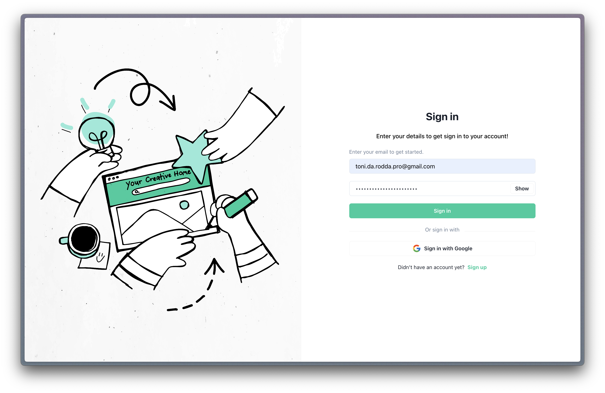
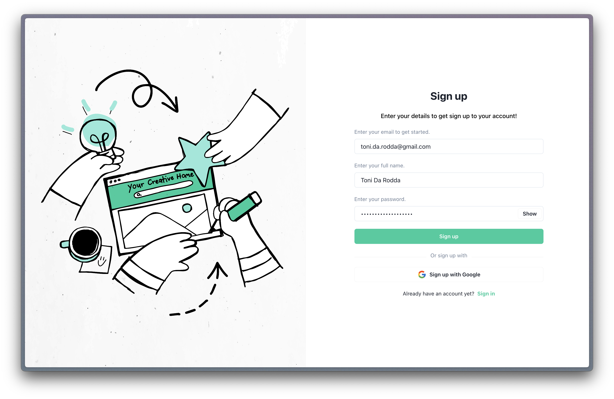

---

# React Template


This project is a React template designed to accelerate development by providing essential features such as state management, internationalization, data fetching, navigation, and UI components with Chakra UI.

## Screenshots

Created using the default components provided in the project.

### Welcome Screen


### Login Screen



### Register Screen



## Features

- **🌍 Internationalization (i18n)**
  - Multi-language support using `react-i18next` for seamless localization.

- **🗃️ State Management with Redux**
  - Centralized state management for efficient global state access and updates.

- **🔍 Data Fetching with React Query**
  - Optimized data fetching, caching, and synchronization.

- **🧭 Navigation**
  - Smooth and intuitive navigation using `react-router-dom`.

- **⚛️ Component-Based Architecture**
  - Modular design with reusable UI components and consistent styling using Chakra UI.

- **📦 Common Utilities**
  - Helper functions and utilities for streamlined development.

- **🔗 Axios Management**
  - Configurable API requests using Axios with built-in error handling and response management.

- **🌐 WebSocket Management**
  - Real-time communication support using WebSockets.

- **🍪 Cookie Management**
  - Simplified management of cookies for authentication and user sessions.

- **🔒 Authentication**
  - User authentication and registration with secure token management.

## 🚀 Getting Started

### Prerequisites

Ensure you have the following installed:

- Node.js (v14 or higher)
- Yarn
- A code editor (e.g., VSCode)

### Installation

1. **Clone the repository:**

   ```sh
   git clone git@github.com:ToniDarodda/react-template.git
   cd react-template
   ```

2. **Install dependencies:**

   ```sh
   yarn install
   ```

3. **Configure environment variables:**

   Update the `.env` file in the root directory with your configuration settings:

   ```sh
   REACT_APP_API_URL='https://your-api-url.com'
   REACT_APP_SOCKET_URL='https://your-socket-url.com'
   ```

### Running the Application

1. **Start the development server:**

   ```sh
   yarn start
   ```

2. **Open the application:**

   The app will be available at `http://localhost:3000` in your web browser.


## 🧪 Testing

To run the tests, use the following command:

```sh
yarn test
```

## 🛠️ Scripts

- **🧹 Format code using Prettier:** `yarn format`
- **🏃‍♂️ Start the application:** `yarn start`
- **🔍 Lint the code using ESLint:** `yarn lint`
- **🧪 Run the tests:** `yarn test`
- **🚀 Run end-to-end tests:** `yarn test:e2e`

## 📜 License

There is no license, you're free to use it.

## 👤 Author

[Toni Da Rodda](mailto:toni.da.rodda.pro@gmail.com)

## 🛠️ Icons

- **🚀 Deployment**
- **⚙️ Configuration**
- **📄 Documentation**
- **🔧 Maintenance**
- **🔒 Security**
- **📫 Email Integration**
- **📈 Performance Optimization**
- **⚡ Gain Time**

---

Feel free to contribute to this project by submitting issues or pull requests.

For any questions or support, please contact [Toni Da Rodda](mailto:toni.da.rodda.pro@gmail.com).

---

